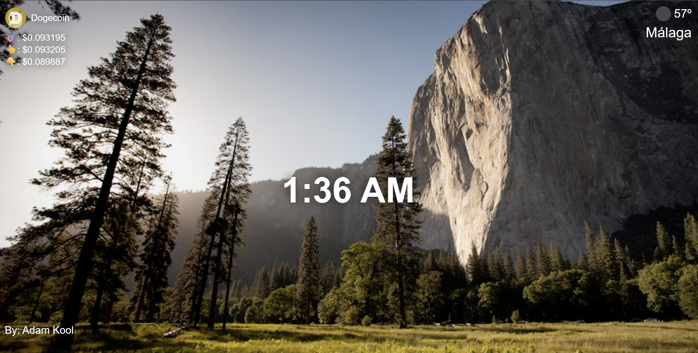

# Personal Dashboard Chrome Extension

**Personal Dashboard** is a minimalist Chrome New Tab extension built with **HTML, CSS, and Vanilla JavaScript** as part of my learning journey through the **Scrimba Frontend / Full‑Stack Web Development Career Path**.

The project focuses on consuming real‑world APIs, working with asynchronous JavaScript, and building a clean, visually engaging UI that delivers useful information at a glance.

---

## 🎨 Preview



---

## 🛠 Tech Stack

- HTML5
- CSS3
  - Flexbox layout
  - Full‑viewport responsive design
- Vanilla JavaScript (ES6+)
- Chrome Extensions API (Manifest V3)

---

## ✨ Features

- Dynamic **New Tab dashboard** replacement
- Random **nature background** fetched from Unsplash
- Live **clock**, updated every second
- **Geolocation‑based weather** display
- **Cryptocurrency tracker** (Dogecoin)
  - Current price
  - 24h high
  - 24h low
- Graceful fallbacks for failed API requests

---

## 📦 APIs Used

- **Unsplash API** (via Scrimba proxy)  
  Random background images

- **CoinGecko API**  
  Live cryptocurrency market data

- **OpenWeatherMap API** (via Scrimba proxy)  
  Local weather data using browser geolocation

---

## 📁 Project Structure

```
.
├── index.html        # Dashboard layout
├── index.css         # Styling and layout
├── index.js          # API calls and logic
├── manifest.json     # Chrome extension configuration
├── icon.png          # Extension icon
└── README.md         # Project documentation
```

---

## ▶️ How to Run

1. Clone or download this repository.
2. Open Chrome and navigate to:

```
chrome://extensions/
```

3. Enable **Developer mode** (top‑right).
4. Click **Load unpacked**.
5. Select the project folder.
6. Open a new tab to view the dashboard.

No frameworks, build tools, or dependencies are required.

---

## 🔐 Permissions & Privacy

This extension uses:

- **Geolocation** – to fetch local weather data
- **New Tab override** – to replace Chrome’s default New Tab page
- **External APIs** – to retrieve live data

No personal data is stored or persisted.

---

## 🎯 Learning Goals

This project was built to practice and reinforce:

- Working with third‑party APIs
- Handling asynchronous JavaScript with `fetch`
- DOM manipulation
- Error handling and fallbacks
- Chrome Extension fundamentals (Manifest V3)
- Building UI‑focused JavaScript projects

---

## ⚠️ Current Limitations

- Cryptocurrency selection is hard‑coded (Dogecoin)
- Weather data uses **imperial units (°F)**
- No user configuration or settings

---

## 🚀 Future Improvements

- Allow users to select different cryptocurrencies
- Toggle between **metric / imperial** units
- Add loading and error states to UI
- Improve accessibility (contrast and focus styles)
- Add optional user preferences stored with `chrome.storage`

---

## 👤 Author

Created by **Federico Celia**  
Frontend / Full‑Stack Developer in progress

🔗 LinkedIn: https://www.linkedin.com/in/federico-celia-13b3851a8/

---

## 📄 License

This project is for **learning and personal use only**.

You are free to:

✔ Use the code  
✔ Modify it  
✔ Share it

Commercial use is **not permitted**.

---
